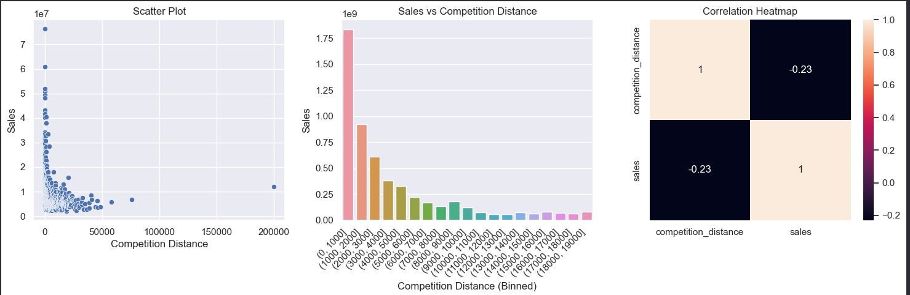
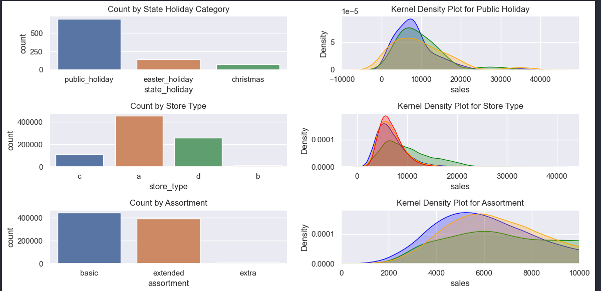
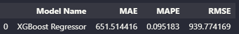
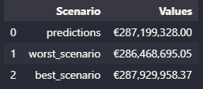
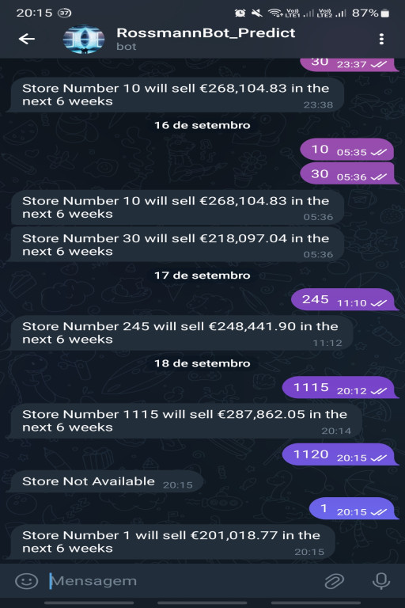

# The Rossmann Sales Forecast

## Business Problem

The business problem at Rossmann is the need to accurately forecast the daily sales of each of the more than 3,000 stores over the next 42 days. This is crucial to determine the investment needed in store renovations to improve operational efficiency and boost sales. The CFO is responsible for making informed decisions based on these forecasts. The problem involves data analysis, seasonality and other complex factors that affect sales. Potential methods include time series and regression, and the desired solution is a sales forecasting model accessible through an app. Prediction accuracy is critical to project success.
And this project aims to analyze and model retail store sales data using various data science techniques and machine learning algorithms. The dataset includes information about different stores and their daily sales performance over a certain period.

## The Solution Strategy

Develop a machine learning model that predicts the sales forecast with a margin of error of no more than 10%.

**Step 01. BUSINESS UNDERSTANDING** : Acquire in-depth knowledge about the company requesting the solution and the sector in which it operates.

**Step 02. BUSINESS PROBLEM** : Clearly and precisely defines the problem or challenge that data analysis aims to solve within the business context.

**Step 03. DATA COLLECTION** : Obtain from relevant datasets required for the DS project.

**Step 04. DATA DRESCRIPTION** : Use statistics metrics to identify data distribuctions.

**Step 05. DATA CLEANING AND PRE-PREPARATION** : Transformation and enhancement of the raw data obtained to make it suitable for analysis and modeling.

**Step 06. EXPLORATORY DATA ANALYSIS (EDA)** : Explore data to find insights and the features that better describe the fenomonous.

**Step 07. DATA MODELING** : Essential step to structure and provide relevant info for effective learning algorithms.

**Step 08. TRAINING OF MACHINE LEARNING ALGORITHMS** : Machine Learning Model Trainning.

**Step 09. FINE TUNING** : Find the best values of each parameter of the select Model.

**Step 10. TRANSLATION AND INTERPRETATION OF THE ERROR FOR THE BUSINESS TEAM** : Convert the performance of the Machine Learning model into a business result.

**Step 11. DEPLOY MODEL TO PRODUCTION** : Deploying the machine learning model in a production environment, where it can be accessed by other people, systems, and applications.

## The Dataset

The dataset is available on kaggle plataform (https://www.kaggle.com/c/rossmann-store-sales/data).

## Top Data Insights 

Sales grow more the shorter the distance to a competitor. 

Sales grow more to store types "A" and "D".

Sales grow more in public Holidays.

Sales grow more to smaller assortment.

## Machine Learning Models

I used in this step the models:
* Average - Baseline
* Linear Regression
* Lasso Regression
* Random Forest Regressor
* XGBoost Regressor

The performance indicated for using a Random Forest Model. However, in this first stage we used XGBoost as it proved to be faster and with not much difference.

## Models Performance

XGBoost performed well, with a margin of error of **9.52%** more or less in relation to the actual sales values

## Convert Model Performance to Business Values

In test data, I calcuted the prediction and comparision with the worst and better cenaries. The model brings a safety data to the CEO decision to sales reform investiment.

## Basic Usage:

1. **Start a conversation:** Open the Telegram app and start a conversation with the bot [telegram bot](https://t.me/prediction_rossmann_bot).
2. **Digital Commands:** Send the store number, in the range of 1 to 1115 and he will answer you the sales forecast.

## Next Steps:
Next steps include:
+ Continuous monitoring of the model in production.
+ Collection of model usage data for analysis.
+ Regularly evaluate performance and adjust as necessary.
+ Exploration of model optimization opportunities such as:
    - Development of specific models for stores with lower performance.
    - Exploration of additional data and resources to improve forecast accuracy.
    - Continuous refinement of models and adjustments of hyper parameters.
    - Implementation of refined models in production to improve inventory management and operational efficiency.
    - Creation of a new variable to answer the question: Stores with more days on sale should sell more.
- Scalability consideration to handle an increase in request volume.

Successful deployment of the model is an important milestone, but ongoing maintenance and improvement are essential to ensure the model continues to be a valuable tool for the company.

## Who i am

My name is Emerson Carlos de Oliveira, I am a lawyer, a software engineering student, and I am a Data Scientist in training.

Email: emerson_uo@hotmail.com

Linkedin: https://www.linkedin.com/in/emerson-carlos-oliveira/
